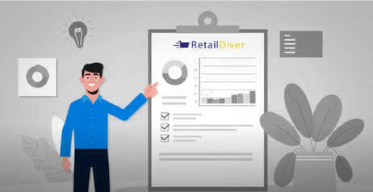

# Definición General de RetailDiver

Se definirán todos los Dashboards, KPI´s y Relojes de Alerta que apoyarán al área Comercial y Logística para realizar una eficiente Gestión Comercial y Logística, en especial de Inventarios, tanto desde la Administración General como en el Punto de Venta.

En dichos Dashboards, KPI´s y Relojes de Alerta, se podrá visualizar:
1. Totales
2. Aplicación de filtros por Retailer, Cadena, … todos aquellos que se hayan dispuesto en la Maestra de Locales y,
3. Aplicación de filtros por Marca, Categoría, Código de Producto, … todos aquellos que se hayan dispuesto en la Maestra de Productos.
4. Aplicación de otros filtros que provengan de otras Maestras que se desarrollen más adelante.
5. Drill down

