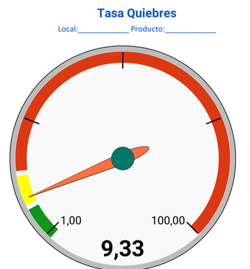
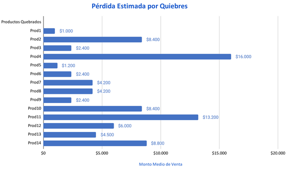
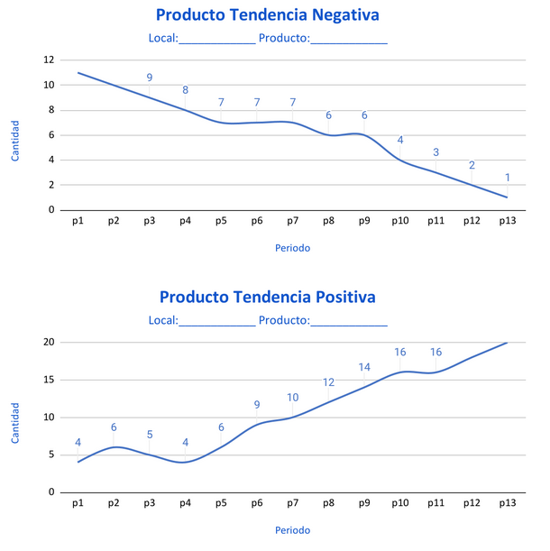
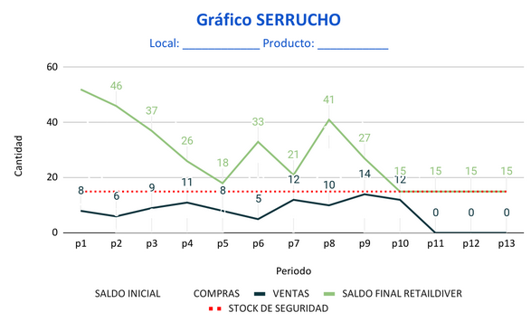
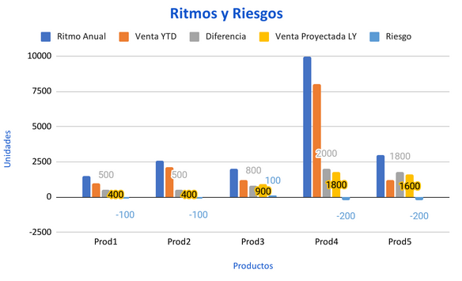

# Panel 1: Alertas

## Tasa de Quiebres

### Que es un quiebre de stock ?
Es de los inconvenientes mas comunes de una empresa. En el caso de un supermercado, ocurren cuando en sus bodegas y puntos de venta **se agota la existencia de un determinada mercancia en demanda.**

### Causas de quiebre
No existe un patro, pero si causas destacables como:
    + Inadecuada gestión de pedidos y recepción de productos.
    + Retrasos en los despachos y las entregas del proveedor.
    + El proveedor no envía la cantidad de mercancía estimada según la planificación de la demanda.
    + Errores en la proyección de la demanda.
    + Algún fenómeno fuera de lo normal que genere niveles extraordinarios de demanda.
    + Incumplimiento de los acuerdos con el proveedor.

### Formulas del quiebre de stock

Siendo **CNS** la *cantidad no suministrada* y **CUB** el *coste unitario en bodega*, el impacto economico se calcula como:

$RS=\Sigma({CNS \cdot CUB})$

Ahora si se desea obtener un procentaje, tendría que incluirse la *cantidad total solicitada* (**CTS**) y el *coste unitario* (**CU**):

$RS(\%)={(CNS \cdot CUB) \over (CTS \cdot CU)}$

## Detalle de Productos Quebrados

Es un despliegue gráfico (barras transversal) que muestra todos los productos que tienen la condición de quebrados.
Este detalle podrá filtrarse en base a los índices de Rotación, dejando a los que tienen mayor desempeño, destacados en otro color.

## Trends de productos

## Alerta de punto de reorden - "Serrucho" (Reorder Point)

### Que es el reorder point ?
Es un punto especifico en el cual el stock debe ser repuesto. En otras palabras, el punto indicado para realizar el "restock".

## Ritmos (Meta) de Venta vs YTD
