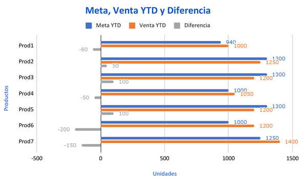
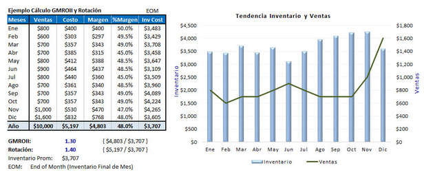

# Panel 7: Metas y GMROII

## Cumplimiento de Metas

## GMROII

**GMROII:** El GMROII (Retorno de Inversión de Margen Bruto) es una de las métricas más importantes para medir la rentabilidad del inventario de una empresa. Esta fórmula es útil para que los minoristas evalúen la rentabilidad de sus productos y tomen decisiones informadas sobre su inventario. 

&nbsp; **Fórmula y ejemplos numéricos para su cálculo.**

&nbsp; La fórmula del GMROII es bastante sencilla: se divide el margen bruto por el promedio del inventario total. El margen bruto es la diferencia entre el precio de venta de un producto y el costo de los bienes vendidos. El promedio del inventario total se calcula sumando el inventario inicial y el inventario final y dividiéndolo por dos.

&nbsp; Por ejemplo, si una empresa tiene un margen bruto de \$100,000 y un inventario promedio de \$ 50,000, el GMROII sería de 2.0. Esta fórmula indica que por cada dólar invertido en inventario, la empresa gana \$2.0 de margen bruto. Una tasa de GMROII superior a 1.0 indica que la empresa está generando más ganancias que la inversión en su inventario, lo que es una señal positiva.

&nbsp; Una de las formas en que los minoristas pueden mejorar su GMROII es ajustando sus niveles de inventario. Por ejemplo, si una empresa tiene una tasa de GMROII baja, puede reducir su inventario para que su inversión en el inventario sea menor. De esta manera, la empresa puede aumentar su tasa de GMROII. Sin embargo, es importante encontrar un equilibrio para evitar una falta de inventario que pueda afectar las ventas y la satisfacción del cliente.

&nbsp; Otra forma en que los minoristas pueden mejorar su GMROII es reduciendo costos. Por ejemplo, si una empresa reduce los costos de los bienes vendidos, puede aumentar su margen bruto y, por lo tanto, su tasa de GMROII. También pueden aumentar los precios de venta de los productos para aumentar el margen bruto.

&nbsp; Además, es importante tener un sistema de gestión de inventario eficiente para mejorar el GMROII. Los minoristas pueden utilizar tecnología para automatizar el seguimiento de los niveles de inventario y predecir la demanda futura. Esto les permite tomar decisiones informadas sobre cuándo pedir más productos y cuántos productos deben tener en su inventario.

&nbsp; Al aplicar el GMROII a categorías de productos específicas, los minoristas pueden tomar decisiones comerciales informadas. Por ejemplo, si un minorista encuentra una categoría de producto con una tasa de GMROII alta, puede concentrar sus esfuerzos en esa categoría para maximizar su rentabilidad.

&nbsp; En conclusión, el GMROII es una métrica importante para que los minoristas midan la rentabilidad de su inventario. Al ajustar los niveles de inventario, reducir costos, aumentar los precios de venta y utilizar tecnología, los minoristas pueden mejorar su GMROII y maximizar su rentabilidad. Es esencial para los minoristas utilizar esta métrica para tomar decisiones informadas y mantener una ventaja competitiva en el mercado.

&nbsp; Otro Ejemplo más específico:

&nbsp; Supongamos que una tienda de ropa tiene un margen bruto de \$250,000 y un inventario promedio de \$100,000 durante el año fiscal 2022. Para calcular el GMROII, se divide el margen bruto por el promedio del inventario total:

&nbsp; GMROII = Margen bruto / Promedio del inventario total

&nbsp; GMROII = \$250,000 / \$100,000

&nbsp; GMROII = 2.5

&nbsp; Esto significa que por cada dólar invertido en inventario, la empresa gana \$2.5 de margen bruto. Una tasa de GMROII superior a 1.0 indica que la empresa está generando más ganancias que la inversión en su inventario, lo que es una señal positiva.

&nbsp; En este ejemplo, una tasa de GMROII de 2.5 sugiere que la tienda de ropa es rentable en términos de inventario. Sin embargo, para obtener una comprensión más detallada, debemos considerar el GMROII de cada categoría de productos.

&nbsp; Supongamos que la tienda de ropa tiene tres categorías de productos: camisas, pantalones y accesorios. Los datos de margen bruto y el inventario promedio de cada categoría se muestran a continuación:

&nbsp; Camisas: Margen bruto de \$100,000 y un inventario promedio de \$50,000.
&nbsp; Pantalones: Margen bruto de \$75,000 y un inventario promedio de \$25,000.
&nbsp; Accesorios: Margen bruto de \$75,000 y un inventario promedio de \$25,000.

&nbsp; Para calcular el GMROII de cada categoría, aplicamos la fórmula del GMROII a cada una:

&nbsp; GMROII de camisas = \$100,000 / \$50,000 = 2.0
&nbsp; GMROII de pantalones = \$75,000 / \$25,000 = 3.0
&nbsp; GMROII de accesorios = \$75,000 / \$25,000 = 3.0

&nbsp; Esto sugiere que la categoría de pantalones y accesorios son las más rentables en términos de inventario. La tienda de ropa puede utilizar esta información para tomar decisiones informadas, como aumentar la cantidad de productos de estas categorías en el inventario y reducir la cantidad de productos de la categoría de camisas.

&nbsp; En resumen, el GMROII es una métrica importante para que los minoristas midan la rentabilidad de su inventario. Al calcular el GMROII para cada categoría de productos, los minoristas pueden tomar decisiones informadas sobre el nivel de inventario de cada categoría y maximizar su rentabilidad. Es esencial para los minoristas utilizar esta métrica para tomar decisiones informadas y mantener una ventaja competitiva en el mercado.

### **Cómo calcular el GMROI - versión de Gravitar Biz**

#### Paso 1. Calcular su margen bruto en términos monetarios y en porcentaje.
La fórmula para calcular el margen bruto en cifras monetarias es la siguiente:

[\$ Margen Bruto] (valor monetario) = [\$ Ventas] – [\$ Costo de artículos vendidos]

Y para expresar el margen bruto como porcentaje:

[% Margen Bruto] (porcentaje) = ( [\$ Margen Bruto] / [\$ Ventas] ) * 100

#### Paso 2. Calcular el promedio del 
inventario al costo.

Para obtener el promedio de inventario a costo anualmente, sume todos los inventarios que terminan por cada mes de este año, además de la finalización del inventario para el año anterior. Para obtener el promedio, divida el número de inventarios entre 13, el cual es la suma  del número de inventarios.

#### Paso 3. Calcule el coeficiente de inversión a sus ventas del inventario.
Esto se obtiene dividiendo el total de ventas entre el inventario a precio de costo,

#### Paso 4. Cálculo del porcentaje GMROI.
GMROI= [\$ Ventas anuales] / [\$ Promedio Inventario a costo] * [% Margen bruto]

Para concluir,  se presenta un ejemplo en el cual se realizan los cálculos anteriormente mencionados para la obtención del Margen Bruto de Retorno de Inversión (GMROI).

##### Ejemplo:

A través de un cuidadoso análisis, se puede ver que líneas, departamentos o categorías son más rentables para su inversión en inventario.

Asumiendo que tenemos unas ventas totales de 1,000,000 MN y un costo de artículos vendidos de 380,000 MN. El cálculo del margen bruto sería de la siguiente forma:

###### Paso 1.

[\$ Margen bruto] = 1, 000,000 MN – 380,000 MN = 620,000 MN

[% Margen Bruto] = 620,000 MN / 1, 000, 000 MN = 0.62 * 100 = 62%

###### Paso 2.

Supongamos que la suma de los inventarios, incluyendo el fin de año anterior es de 3,500,000 MN, el promedio del inventario al costo sería:

[\$ Promedio Inventario a Costo] = [\$ Suma Inventario Anual] / 13

[\$ Promedio Inventario a Costo] = 3,500,000 MN / 13 = 269, 230.79 MN

###### Paso 3.

[Coeficiente de inversión] = [\$ Ventas Anuales] / [\$ Promedio Inventario a Costo]

[Coeficiente de inversión] = 1, 000, 000 MN / 269, 230 MN = 3.7142

###### Paso 4.

Por último el cálculo del GMROI:
GMROI = [% Margen Bruto] * [Coeficiente de Inversión]
GMROI =  62% * 3.7142 = 230%
Este inventario arroja un 230%, lo cual quiere decir que se estará obteniendo \$2.30 MN por cada  \$1 MN invertido en el inventario anualmente en esta categoría.
